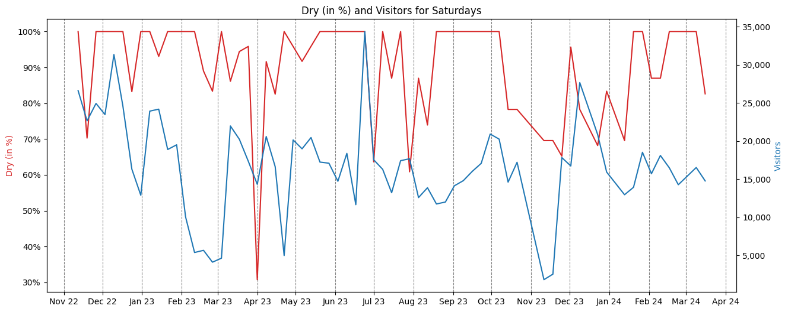

# Does Weather Affect Visitor Numbers in Heidenheim Downtown?

Hypothesis: There is a correlation between weather conditions and the volume of visitors in Heidenheim downtown. For comparative analysis, only Saturdays are considered.

## 1. Collect Weather Data

Weather data is collected from the weather station sensor located at Levillan Park. The data is accessed through the Smart City API, focusing solely on the sensor's "state" parameter. This data is stored in the [weather-data.json](weather-data.json) file.

First we need to inspect the given weather data. The following figure shows the diffrent state values for each data point:

Initial inspection reveals four distinct state values: "dry", "rain", "rain with risk of ice", and "cold - wet". Due to limited data for the "rain with risk of ice" label, it's not substantial for correlation analysis. Therefore, states are simplified to "dry" and "not dry".

We assume weather impacts the entire day uniformly. Thus, all sensor values for a given day are aggregated. Each day's data points are tallied, and the proportion of dry states is calculated as a "dry rate in percent".

The following figure shows this dry rate:

The graph shows all date points in a line plot. On the x-axis the time is displayed and on y-axis the dryness in percent. A thing to notice is, that the weather is mostly dry for long periods. This one-sided overhang can lead to underrepresentation, could make it difficult to establish a correlation.

The visitor of each days are accumulated to the total of all visitors on this day. Also we only analyze the saturdays and can ignore the other days.

## 2. Compare Data

Comparison between dry rate and visitor count is illustrated in the figure below:

The x-axis denotes time with a monthly grid. Each month comprises approximately four Saturdays, resulting in four data points. While no clear correlation is evident, occasional similarities exist, notably dips around the end of December 2022, April 2023, and mid-October to mid-November 2023.

The calculated cross-correlation between both values is 0.15, indicating a weak positive correlation. This suggests that as the dryness percentage increases, so does the number of visitors.

A scatter plot of all data points, depicted below, further illustrates this weak correlation:

The red line represents a linear regression model, demonstrating the weak correlation. Although linear regression provides a predictive model, it lacks precision. For instance, a 0% dry rate predicts 10,444 visitors, while a 100% dry rate predicts 17,329 visitors.This prediction model does not provide solid results.

## 3. Results

Mathematically, no definitive correlation exists between weather and visitor numbers. Visits to the city center are influenced not only by weather but also by other factors like events and holidays. Nevertheless, graphical trends can be observed, offering insights despite the absence of a direct relationship.