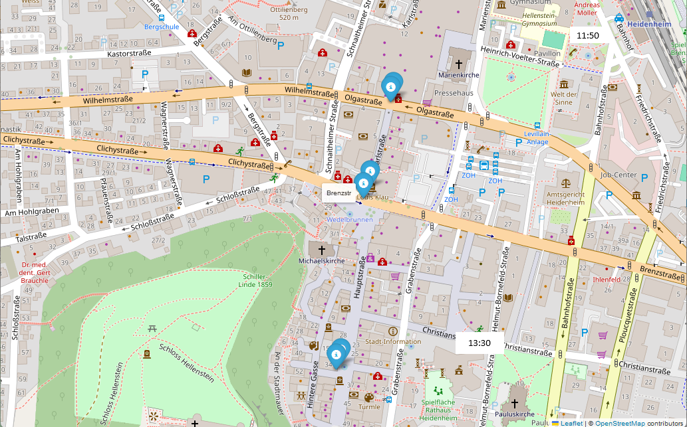
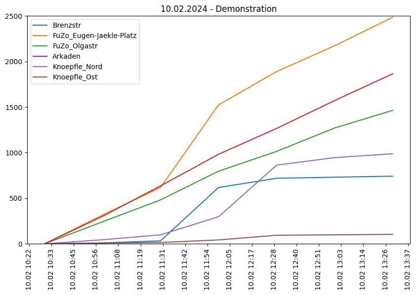
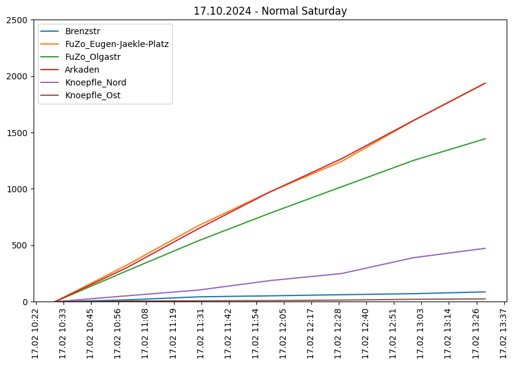

# Demonstration: "Nie wieder ist jetzt!"

News-Paper article about the demonstration on 10.02.24:

https://www.hz.de/lokales/heidenheim/heidenheim-demonstriert-gegen-rechtsextremismus-und-fuer-eine-bunte-gesellschaft

According to the newspaper article, the demonstration against right-wing extremism began at 11:55 am at Heidenheim train station and later on to the town hall, where a rally was held from 1:30 pm.

The two stations and the SmartCity sensors for people counting are shown on the following map:

According to the police count, there were around 2,500 people as of 1 pm.

## Analysis of the sensors

The two graphs show the number of people (totaled) on the day of the demonstration (10.02.) and as a comparison value the following Saturday (17.02.) in the period from 10 am to 2 pm:

A large number of people can be seen for the demonstration period. The movement of people can also be determined by the sensors: Around 11:30, the number of people at Eugen-Jäckle Platz and in Brenzstraße suddenly increases. After about half an hour, the demonstration arrived at the Knoepfle_Nord sensor and the count increased here too.

The absolute numbers give an approximate impression of the size of the demonstration. The difference between the two Saturdays is shown in the last column of the table:

| Sensor | 10.02. | 17.02. | Difference |
| --- | --- | --- | --- |
| Brenzstr | 742 | 87 | 655 |
| FuZo_Eugen-Jaekle-Platz | 2485 | 1936 | 549 |
| FuZo_Olgastr | 1464 | 1444 | 20 |
| Arkaden | 1865 | 1937 | -72 |
| Knoepfle_Nord | 988 | 473 | 515 |
| Knoepfle_Ost | 104 | 25 | 79 |

It is not possible to determine an absolute number of participants in the demonstration. The fact that fewer people were measured in the Schlossarkaden may have to do with the road closures that were set up in the course of the demonstration.