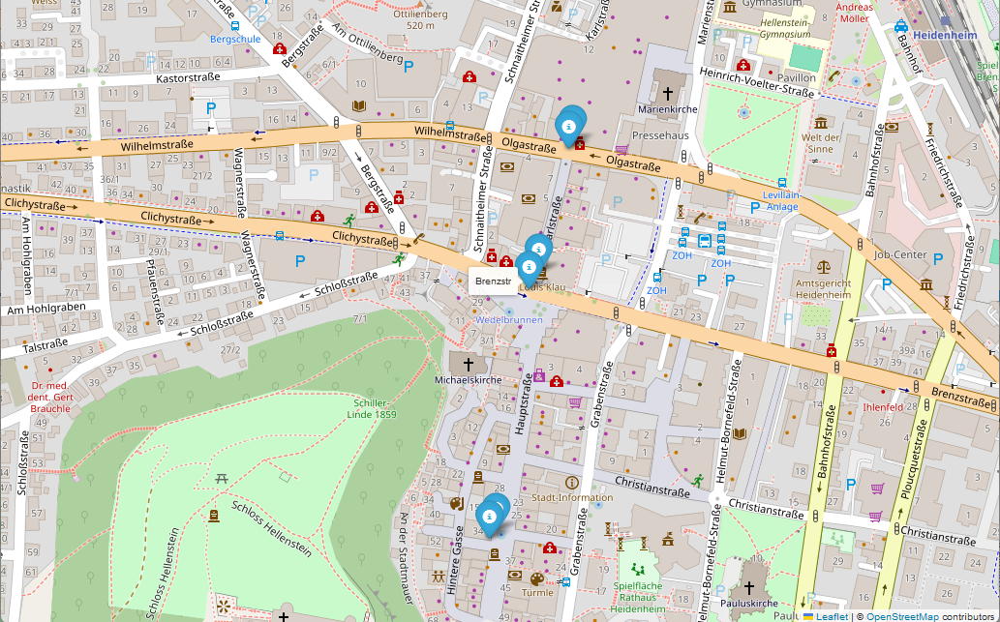
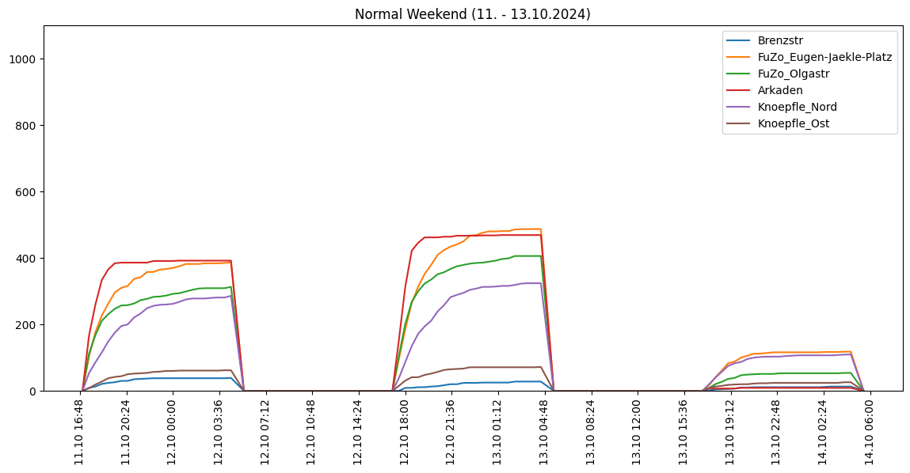
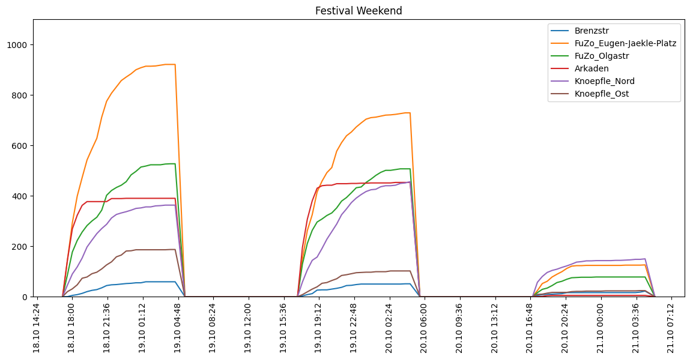
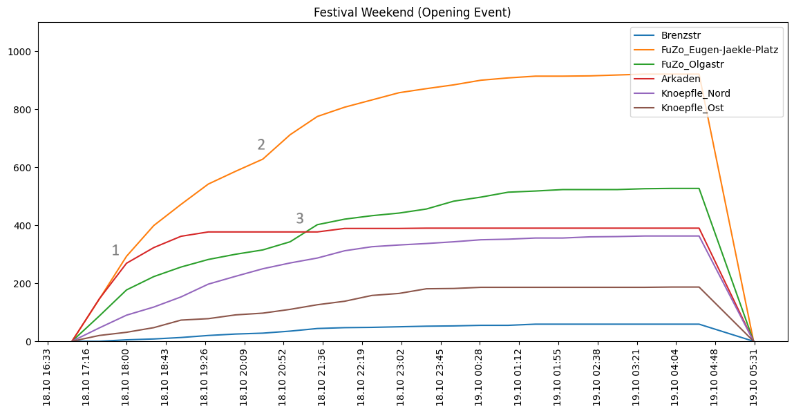

# Hier und Jetzt - Jugendfestival

*Homepage: https://wirsindhierundjetzt.de*

<!-- Dates 2023
- https://www.instagram.com/p/CzesdKGtrqK/?utm_source=ig_web_copy_link&igsh=MzRlODBiNWFlZA==
    - 15. - 16. December 2023
-->
## Sensoren in Fußgängerzone:

## Festival 2024:

Datum: https://www.hz.de/lokales/heidenheim/hier-und-jetzt-so-will-das-kulturbuendnis-alle-jungen-heidenheimer-an-einem-ort-versammeln
    
**18. - 20. October 2024**

**Durchschnittliches Wochenende (11. - 13.10.):**

Zum Vergleich des Besucheraufkommens mit einem "gewöhnlichen Wochenende".

**Festival Wochenende:**

Erste Erkenntnisse:
- Die Bewegungen rund um die Schlossarkaden zeigen, dass die beiden Wochenenden ungefähr vergleichbar sind. Eine hohe Bewegung von "normalen Stadtbesuchern" kurz vor 20 Uhr. Danach keine weiteren Bewegungen mehr.
- Das Festival war sehr gut besucht. Z.B. auf dem Eugen-Jäckle-Platz wurden ca 900 Personen erkannt (dazu im Vergleich an einem regulären Wochenende "nur" ca. 400 Personen) 
- Der Treppenartige Anstieg (z.B. Fuzo Olgastraße; Freitag Abend) deutet auf die Bewegung einer größeren Personengruppe hin (z.B. Start / Ende einer Veranstaltung)

**Analyse Opening Event:**

- (1) Der steile Anstieg des Besucherverkehrs flacht plötzlich um 18:00 Uhr ab. Womöglich hat um diese Uhrzeit eine Veranstaltung begonnen?
- (2) Um ca. 20:30 Uhr bewegt sich eine größere Gruppe über den Eugen-Jäckle Platz. Ggf. das Ende eines Events?
- (3) Um ca. 21:00 Uhr gibt es eine größere Bewegun an der FuZo Olgarstr. Ggf. ein Ende des Events? Besteht zusammenhang mit Gruppe von Eugen Jäckle Platz?

**Offene Punkte und Todos:**

- [ ] Abgleich der Bewegungen mit Programm des Festivals
- [ ] Locations und Sensoren auf Karte visaulisieren
- [ ] Geeignete Visualisierungsform finden
- [ ] Verkehrsdaten aus https://github.com/DumbergerL/hdh-smartcity-archive mit einbeziehen