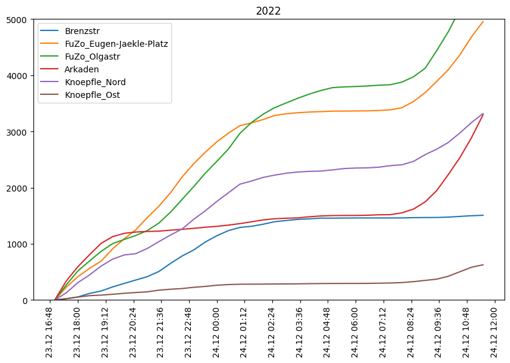
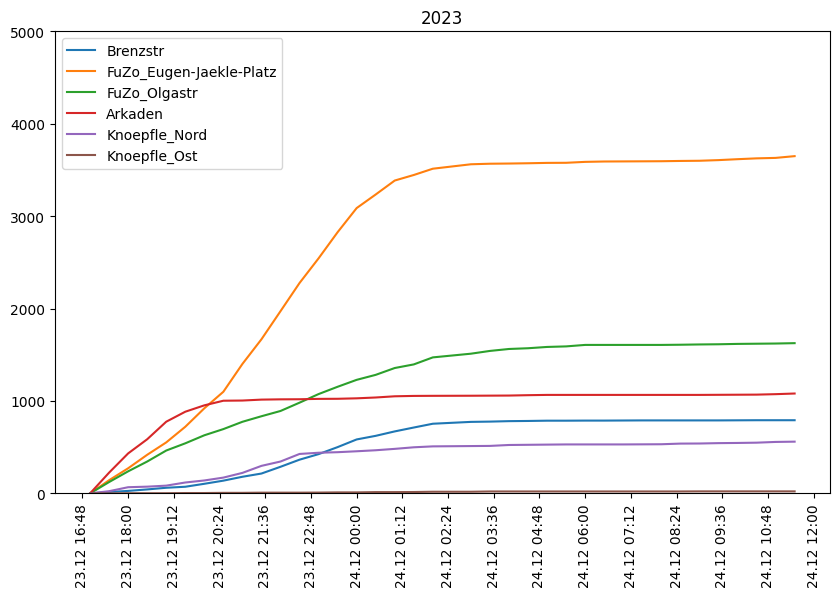

# Warten auf's Christkind - Heidenheim

Waiting for Christ Child is a publik bar event in Heidenheim with a long tradition. Every bar has opend an the streets are full of people: https://www.hz.de/lokales/heidenheim/warten-aufs-christkind-2023-in-heidenheim-alle-infos-rund-um-die-party-verkehr-und-die-regeln

The sensors in the pedestrian zone will allow a comparison of visitor numbers in 2022 and 2023.

## Results

This figure shows the absolute number of visitors over time. Counting starts at 16:30. The y-axis in both graphs ranges from zero to 5000. The most interesting part to compare is the time between 20:30 on 23.12. and 6:00 on 24.12.

**Number of Visitors 2022:**

**Number of Visitors 2023:**

Comparing the two years, it is clear that the absolute number of visitors is much lower in 2023. The following table compares the number of pedestrians from 20:30 on 23.12. to 05:00 on 24.12:

| Sensor | 2022 | 2023 | Difference in % |
| --- | --- | --- | --- |
| Brenzstr | 1.041 | 604 | -42 % |
| FuZo_Eugen-Jaekle-Platz |  1.885 | 2.172 | +15 %|
| FuZo_Olgastr | 2.494 | 796 | -68 % |
| Arkaden | 276 | 58 | -79 % |
| Knoepfle_Nord | 1.377 | 304 | -78 % |
| Knoepfle_Ost | 147 | 15 | -90 % |
| **Total** | 7.220 | 3.939 | **-45%** |

Overall, there were almost half as many visitors in 2023 as in the previous year. Only Eugen-Jäckle-Platz had more visitors than last year.