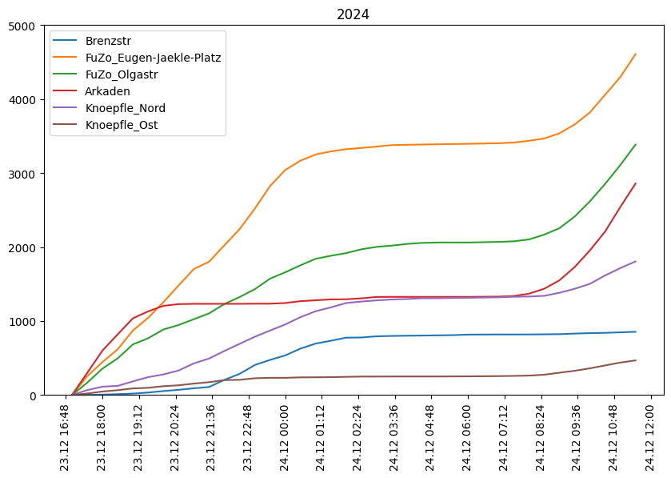
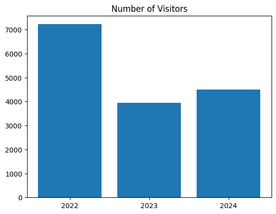

# Warten auf's Christkind - Heidenheim

Waiting for Christ Child is a publik bar event in Heidenheim with a long tradition. Every bar has opend an the streets are full of people: https://www.hz.de/lokales/heidenheim/warten-aufs-christkind-2023-in-heidenheim-alle-infos-rund-um-die-party-verkehr-und-die-regeln

The sensors in the pedestrian zone will allow a comparison of visitor numbers in 2022 and 2023. The sensors are located here: 

## Results

This figure shows the absolute number of visitors over time. Counting starts at 16:30. The y-axis in both graphs ranges from zero to 5000. The most interesting part to compare is the time between 20:30 on 23.12. and 6:00 on 24.12.

**Number of Visitors 2022:**

**Number of Visitors 2023:**

*\*Since December 24, 2023, was a Sunday, there is no increase in visitors to the city center to report (in comparison, see the increase in 2022 and 2024).*

**Number of Visitors 2024:**

Comparing the two years 2022 and 2023, it is clear that the absolute number of visitors is much lower in 2023. The following table compares the number of pedestrians from 20:30 on 23.12. to 05:00 on 24.12:

| Sensor                    | 2022  | 2023  | Difference 2022–2023 in % | 2024  | Difference 2023–2024 in % |
|---------------------------|-------|-------|---------------------------|-------|---------------------------|
| Brenzstr                 | 1,041 | 604   | -42 %                     | 713   | +18 %                    |
| FuZo_Eugen-Jaekle-Platz  | 1,885 | 2,172 | +15 %                     | 1,683 | -23 %                    |
| FuZo_Olgastr             | 2,494 | 796   | -68 %                     | 1,032 | +30 %                    |
| Arkaden                  | 276   | 58    | -79 %                     | 94    | +62 %                    |
| Knoepfle_Nord            | 1,377 | 304   | -78 %                     | 881   | +190 %                   |
| Knoepfle_Ost             | 147   | 15    | -90 %                     | 96    | +540 %                   |
| **Total**                | 7,220 | 3,939 | **-45%**                  | 4,499 | **+14%**                 |

Overall, the number of visitors in 2023 was almost half of what it was the previous year. Among all locations, only Eugen-Jäckle-Platz saw an increase in visitors compared to 2022. Interestingly, visitor activity became more concentrated in Eugen-Jäckle-Platz than in other parts of the city.

The following graphic compares the absolute number of visitors across all three years. It highlights that "Warten aufs Christkind" has lost some of its previous popularity. Although there was a slight increase in visitors in 2024, it was not enough to match the high numbers seen in 2022.

