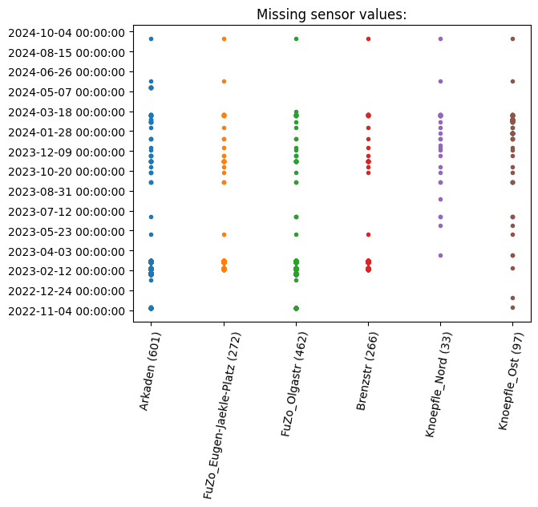

# Missing Sensor Values

All missing sensor values are stored in the [missing_sensor_values.json](missing_sensor_values.json). To provide a visual impression of the gaps the jupyter notebook [VisualizeMissingDates.ipynb](VisualizeMissingDates.ipynb) creates the following scatter plot:

The number at the end of the label shows how many sensor values are missing in the complete time range.